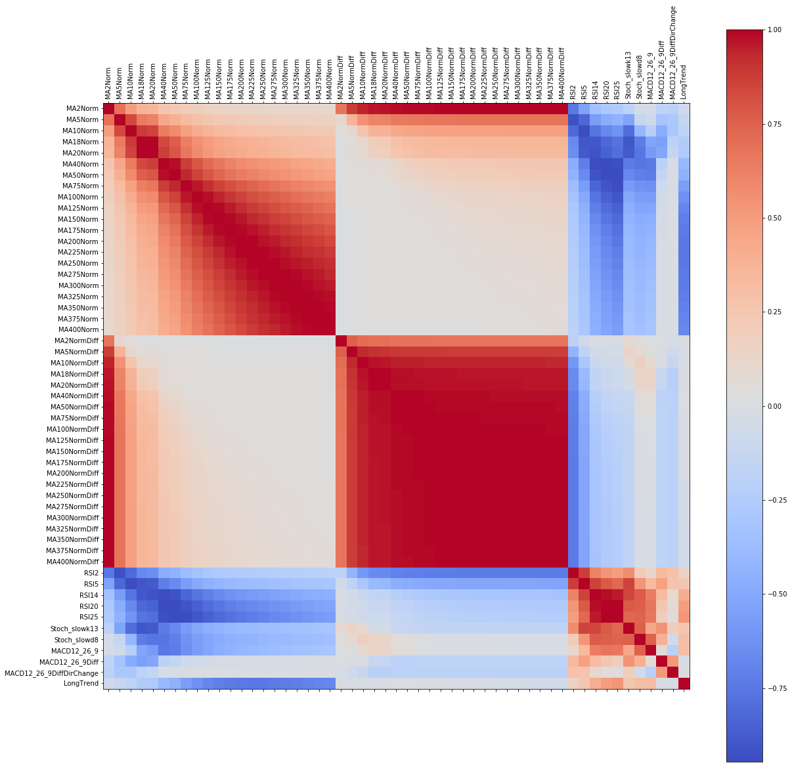

# The Machine Learning Toolbox
Complete process of data preparation, data analysis, model training and prediction of unknown data. The machine learning toolbox is supposed to be used for primary small and middle structured datasets. In this toolbox, a stock index prediction example is provided to show how to use the tools. The tools contains several methods collected from different sources like stack overflow. The purpose is to have a comprehensive set of tools to handle many types of data. Methods that have been copied are referenced by the url. 

## File Structure
The file structure is used as a template to adapt to an arbitrary dataset

Directories:
- 01_Source: Raw data
- 02_Training_Data: Prepared training data with all features and handled NaNs
- 03_Test_Prepared_Data: Prepared test data with all features and handled NaNs
- 04_Model: Stored, trained model
- 05_Results: Results of training results and prediction

Files:
- OMX_S20_Class_y_Feature_X_Construction: S20 is used to create labels if necessary and to generate new features from raw data for training
- OMX_S21_Class_y_Feature_X_Construction: S21 is used only to generate new features for the test data. Generated labels are ignored.
- OMX_S30_Analysis_Feature_Selection: Feature analysis of the X data as well as methods for feature selection, e.g. lasso regression for training data
- OMX_S31_Analysis: Feature analysis of the X test data
- OMX_S40_Model_[Type]: Model optimization for the model [Type]. Only SVM has been optimized so far. 
- OMX_S50_Prediction: A saved model is loaded together with prepared test data and a class prediction is made.

## Data for the Template
To demonstrate the machine learning toolbox, the problem of classifying the trend of the swedish OMXS30 stock index was selected. From the raw data, future samples were used to detemine the current trend. The challenge is to recognize the correct trend, which is simple when looking backward, but hard in advance or in the current moment. The trend is classified in positive and negative trend.

## Content

### Data Preparation
In the data preparation, the y values are generated if applicable. In the OMXS30 example, the positive trend is illustrated as orange and the negative trend is blue.

Features are generated based on the raw X data. In the example, technical indicators like MA, RSI and Stochastics are used to generate features.

### Analysis and Feature Selection
In this process step, the following processing is done:
- Dataset loading
- Dataset cleaning
- Individual X value analysis with 
  - histograms for robust and normal average and standard deviations 
  - Pearson and Spearman rang Correlation matrices 
  - Autocorrelation and partial autocorrelation of time dependent variables 
  - Parallel Coordinates 
- Visualization of missing data
- t-SNE Visualization
- d

