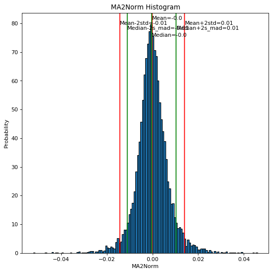
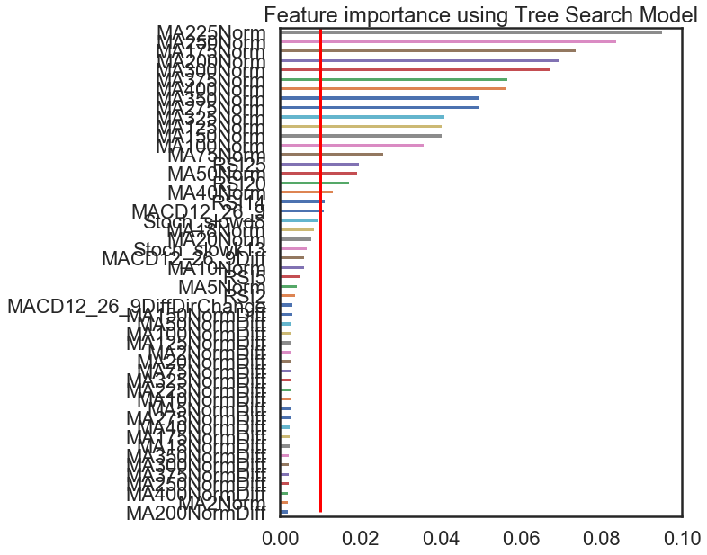
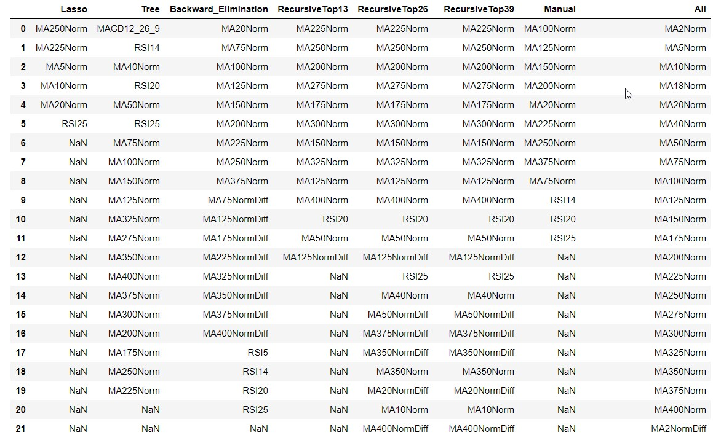
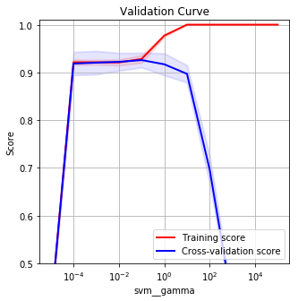
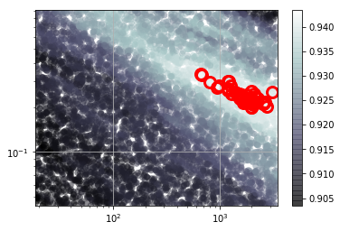
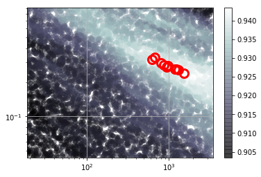
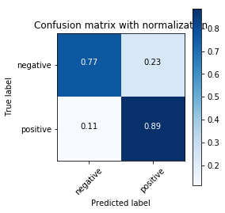
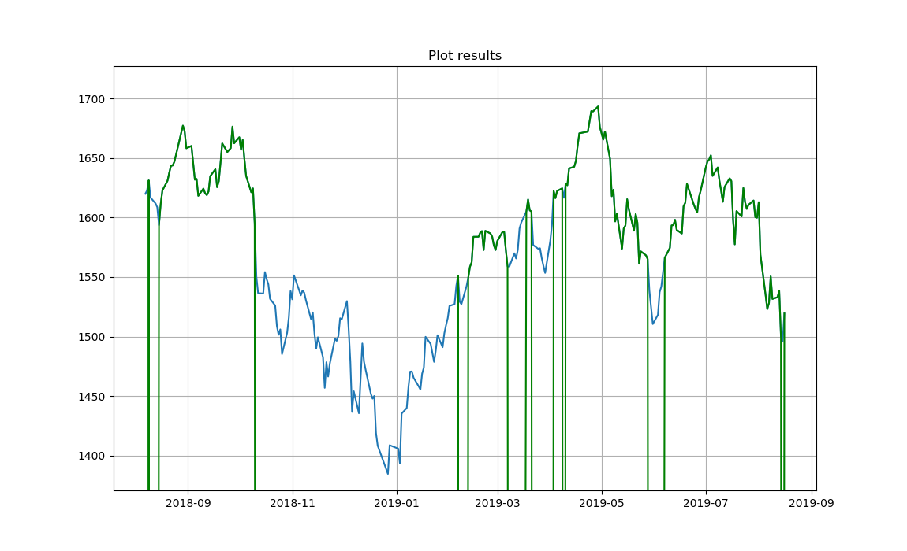

# The Machine Learning Toolbox
The Machine Learning Toolbox represents a complete tool-chain of data preparation, data analysis, model training and prediction of unknown data. 
The machine learning toolbox is supposed to be used for primary small and middle sized, structured datasets. 

In this toolbox, a stock index prediction example is provided to show how to use the tools. The tools contains several methods collected from 
different sources like stack overflow. The purpose is to have a comprehensive set of tools to handle many types of data. Methods that have been 
copied are referenced by the url. 

Machine Learning algorithms from the Scikit Learn library are used in the implementations.

## Setup
In a python 3.6+ environment, run 
```shell
pip install -r requirements.txt
```

In case all libraries cannot be setup correctly, they can be installed manually based on the requirements.txt

## Setup a Project
The toolbox contains several python scripts that are divided into steps, e.g. "step20_". In the following, each step will be described. The file structure 
with scripts is supposed to be used as a template to adapt to an arbitrary dataset, as scripts almost always have to be adapted to their specific use case.  

Toolbox default directories:
- (root): all python scripts used in the process
- samples: Debug and test projects, on which the scripts have been tested.
- doc: documentation

For individual projects, it is recommended to use the directory structure in the sample/debug_omxs30 project. These directories are defined in the project
configuration file and the naming can be changed. Project specifix directories:
- annotations: Place to put the class labels
- data_raw: Put your raw data here, i.e. tables with training and test data as well as inference data
- data_prepared: Prepared training, validation and inference data with all features and handled NaNs. The scripts process the raw data and then puts new 
tables into the prepared data folder. 
- models: Stored, trained models
- results: Results of training and prediction
- config: This is the location, where the configuration files are located. In the script arguments, this path is provided.
- (root): Shell or bat scripts that are used to run the pipeline. They refer to the location of the scripts.


Files:
- OMX_S20_Class_y_Feature_X_Construction: S20 is used to create labels if necessary and to generate new features from raw data for training
- OMX_S21_Class_y_Feature_X_Construction: S21 is used only to generate new features for the test data. Generated labels are ignored.
- OMX_S30_Analysis_Feature_Selection: Feature analysis of the X data as well as methods for feature selection, e.g. lasso regression for training data
- OMX_S31_Analysis: Feature analysis of the X test data
- OMX_S40_Model_[Type]: Model optimization for the model [Type]. Only SVM has been optimized so far
- OMX_S50_Prediction: A saved model is loaded together with prepared test data and a class prediction is made
- ...py: Functions used in the notebooks

## Machine Learning Toolbox Process
The process and the scripts will be described with a example. To demonstrate the machine learning toolbox, the problem of classifying the 
trend of the swedish OMXS30 stock index was selected. From the raw data, future samples were used to detemine the current trend. The challenge is 
to recognize the correct trend, which is simple when looking backward, but hard in advance or in the current moment. The trend is classified 
in a positive and a negative trend.

### Feature and Outcomes Generation Step 2X
For raw data, sometimes, it is necessary to generate features or outcomes. In step 2X, Feature generation as well as outcome generation is applied.
In the data preparation, the y values are generated if applicable. In the OMXS30 example, the positive trend is illustrated as orange and the negative 
trend is blue. The long-term trend has been defined automatically by combining a top-bottom recognition algorithm with Lowess.


Features are generated based on the raw X data. In the example, technical indicators like MA, RSI and Stochastics are used to generate features.

#### step20_generate_groundtruth_stockmarket_from_annotation.py


#### step20_generate_groundtruth_stockmarket.py


#### step21_generate_features.py

#### step22_adapt_dimensions.py

### Analysis and Feature Selection (S30, S31)
In this process step, the following processing is done:
#### Dataset loading
Prepared features and labels are loaded from files. The default format is to load a csv file with features in the columns and with the last column as the class. In the parameters, the class name is defined.

#### Dataset cleaning
The dataset is prepared to be used as an input to a model. Feature can be renamed, inconsitent used of NaN are replaced.

#### Individual X value analysis
Several tools and graphs analyze and visualize different charactersics of the data to create an understanding of its structure and values. The following analyses are made:
- histograms for robust and normal average and standard deviations 
  

- Pearson and Spearman rang Correlation matrices 
  

- Autocorrelation and partial autocorrelation of time dependent variables 


- Parallel Coordinates 


- Visualization of missing data
- t-SNE Visualization 


- UMAP unsupervised and supervised 2D projection 


- PCA Analysis 


#### Feature Selection
Feature selection is done by using several different methods to get the most significant features and adding them to a list of features. This list is then tested in the model optimization step. The following feature selection methods are used:
- Logistic regression with lasso (L1) regulaization 

- Tree based feature selection 

- Backward Elimination
- Recursive Elimination with Logistic Regression

All extracted features are merged into a data frame.


Finally, the prepared dataset and the extracted features are stored.

### Model Optimization (S40)
The model used is a Support Vector Machine. In the model optimization the following process steps are done:

#### Preparation of the Optimization
- Load X, y, class labels and columns
- Split the training data into training and test data, default 80% training data. If timedependent X values, data is not shuffled at the split
- Baseline prediction based on majority class and stratified class prediction to detemine, whether the classifier provides signifiant results
- Test training durations, i.e. training time of the classifier as a function of number of samples to be able to estimate the effort of training

- Test training results as a function of the number of samples to determine the minimum training size


#### Runs
To focus the search on hyper parameters with a wide range, i.e. C and gamma, the optimization is divided into several runs with different focus.

Run 1: Selection of Scaler, Sampler Feature Subset and Kernel. In the first run, the goal is to select the best scaler, sampler, kernel and feature subset. The hyper parameters C and gamma are used in a small range around the default value. Only a subset of the data is used, e.g. 30/6000 samples. In a grid search, the best parameter of the following is determined and fixed.

Scalers:
- StandardScaler()
- RobustScaler()
- QuantileTransformer()
- Normalizer()

Proportion of the different scalers in the top 10% of the results


Statistical difference significance matrix (0 for the same distribution, 1 for different distribution)


Distributions of the scalers for the result range (f1) 


Samples:
- Nosampler()
- SMOTE()
- SMOTEENN()
- SMOTETomek()
- ADASYN()

Kernels:
- linear
- polynomial with degree 2, 3 or 4
- rbf
- sigmoid

Feature Selection
- Lasso	
- Tree based selection
- Backward elimination
- Recursive elimination top 1/3
- Recursive elimination top 2/3
- Recursive elimination top 3/3
- Manual feature selection
- All features

Run 2: Exhaustive Parameter Selection Through Wide Grid Search. The basic parameters have been set. Now make an exhaustive parameter search for tuning parameters. Only a few samples are used and low kfold just to find the parameter limits. The parameters of C and gamma are selected wide.

The results of C and gamma are visible in the following:




The optimal range has been found (white)


As the optimal range is found, the limits of C and gamma are adjusted to cover the top 10 results.

Run 3: Randomized space search to find optimal maximum. Within the best 10 results with a samples, many iterations with random search are performed. 

First e.g. 2000 samples are tested and the 50 best are selected as boundary. 


Then, in a second iteration another 6000 are tested within the new boundary. These values are the base for the deep search.



Run 4: Run best parameters from the intense random search. In the final run, based on the random points with only less samples, more and more samples are tested, but less configurations to finally find the best parameter configuration. 

1st iteration with 400 samples and the best 50 are selected


2nd iteration with 1000 samples and the best 10 are selected



3rd iteration with 6000 samples and the best 3 are selected


The result of run 4 is the best parameter combination.

TODO: Implement bayesian optimization.

#### Optimize Model for Precision/Recall
The training data is split in a new training set and a cross validation set (shuffled and stratified). The training set is trained with the optimal parameters. On the cross validation data, the precision/recall curve is optimized as seen below. The decision threshold is moved in the optimal direction.


#### Validation
The model is trained with the complete training data and the optimal parameters. Then it is evaluated on the test data from the split at the beginning of the notebook. The results are shown in a confusion matrix



The prediction for the OMXS30 example is visualized together with the correct values. The correct values are shown in green above the price, i.e. the positive trend and the predicted values in yellow.


#### Final Training of the complete model
To use the most of the data, finally all available data is used to train the final model. This model is saved in 04/Model

### Prediction (S50, S51)
In the prediction, the model from the training phase is loaded and used for prediction of the unknown data. 



The Machine Learning Toolbox offers multiple tools for preparing, analyzing and training data on an SVM algorithm. 

# Issues
If there are any issues or suggestions for improvements, please add an issue to github's bug tracking system or please send a mail 
to [Alexander Wendt](mailto:alexander.wendt@tuwien.ac.at)


